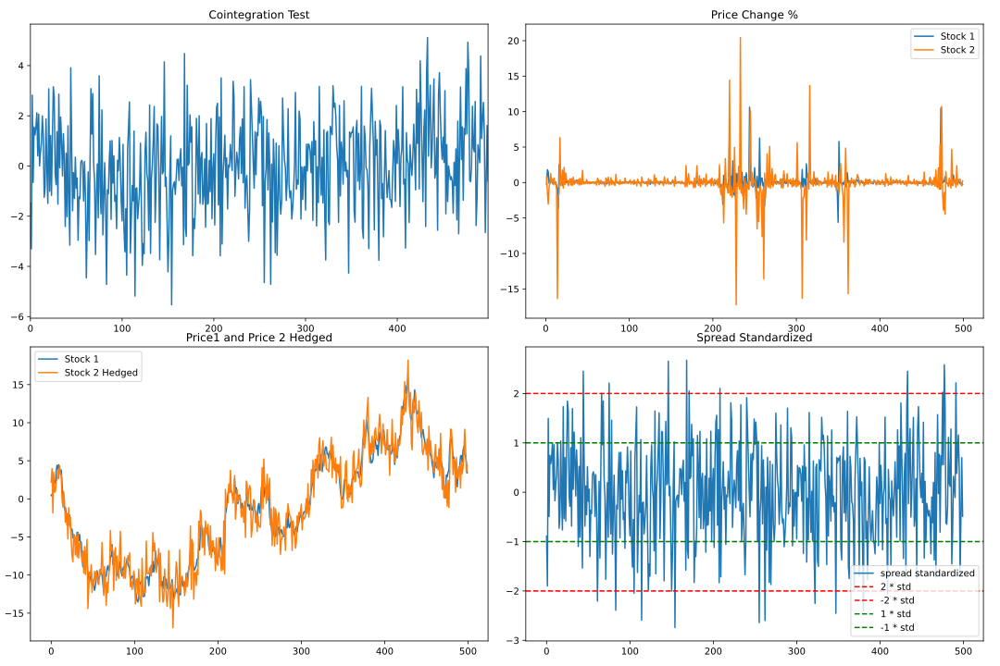

# Stock Pair Cointegration Calculation

> pip install stock_pair_cointegration

## Introduction

Pair trading is based on one assumption Mean Reverting, that a over values stock the price will go down, 
and a under valued stock the price will go up in the end. Pair trading is to trade a pair of 
cointegrated stocks at the same time, that is to take a long position of the under valued stock
and at the same time take a short position of the over valued stock.

This library is to help you to calculate the cointegration of a pair of stocks.

## How pair trading works

As we mentioned below, pair trading is to trade a pair of cointegrated stocks at the same time, 
for a pair in the market, 

For example, 

The spread of the pair in long run, is mean reverting, that is, 
the spread will go back to the mean value, 
so if we trade when the spread is large and exit when the spread is small, 
it will be a gain.

> Surely market is not a static system, spread, cointegration relation keep changing, but if we keeping attention on it,
> we could keep finding the cointegrated pairs and updated the hedge ratio.

- We found Stock A and Stock B are highly cointegrated.
- When the spread is smallert than -2 standard deviation, we take a long position of Stock A and a short position of Stock B.
- When the spread is larger than 2 standard deviation, we take a short position of Stock A and a long position of Stock B.
- When the spread is between -1 and 1 standard deviation, we exit the position.

Let's say we are short A and long B, there are only these possibilities:

| # | Scenario              | Strategy Performance                                                                                     |
|--|-----------------------|----------------------------------------------------------------------------------------------------------|
| 1 | A is down, B is up    | +++, best case for the strategy                                                                          |
| 2 | A and B both are down | +, earned from A, lost from B                                                                            |
| 3 | A and B both are up   | +, earned from B, lost from A                                                                            |
| 4 | A is up, B is down    | -, loss, spread is going to be small, pair strategy will most exit soon if keep going the same direction |

So basically, all dependes on probability, this is why we need to find the cointegrated stocks.
Because they will be each other's hedge and signal, which is make it in high probability to fall into case 1 to 3, but low probability to fall into case 4.

In sum, it is a very old yet effective strategy, even in case 2, when both stocks are down, 
we still earn money or loss less than the market average.

## Where does Pair Trading be used?

- Gold and USD
  - Imagine you are a gold miner, you have a lot of gold, and you want to hedge the risk of gold price going down.
- Target Currency and USD 
  - Imagine your business is in Australis, but you have a lot of USD from businees, you want to hedge the risk of JPY going down.
- Cointegrated Stock Pair
  - This is why this library is created, to help you to find the cointegrated stock pair.
- Others